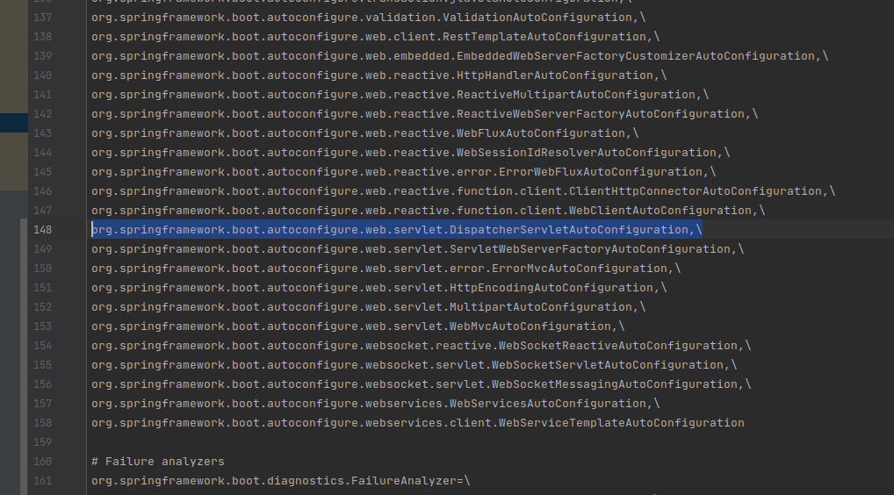
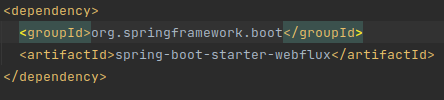
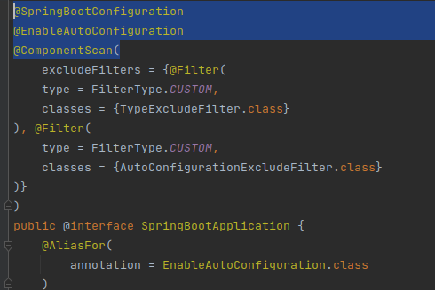
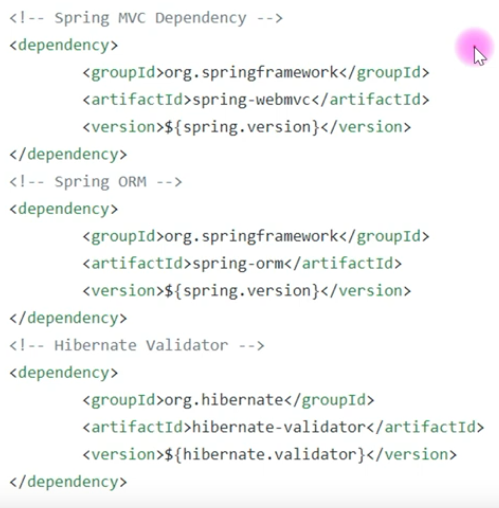
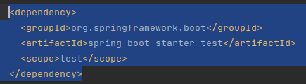

# Spring Boot - Java Guides

## 1. What is Spring Boot

### Starting
Spring is good for several reasons:

* Dependency injection;
* Database transaction management;
* Integratin with other Java frameworks;
* Web MVC frameworkd for building web applications;

Spring Boot is used to boot Spring framework applications, in order to quickly create production ready Spring-based applications.

Spring Boot is an extension of Spring Framework, it uses all of its libraries.

Key featuers of SB:

* Spring boot starters;
* Spring boot autoconfiguration;
* Externalized configuration;
* Spring boot actuator;
* Easy to use embedded servlet container support;

### Without Spring Boot

When using MVC, we need to configure:

* Component scan;
* Dispatcher servlet;
* View resolver;
* Web jars (for delivering static content) among other things;

Hibernate/JPA:

* Data source;
* Entity manager factory/sessino fatory;
* Transaction manager and other things;

When we use cache:

* Cache configuration;

When we use message queue:

* Message queue configuration;

When we use NoSQL database:

* NoSQL database configuration;

To help developers to focus only on business logic rather than external configurations, there is Spring Boot.


## 2. Spring Boot key features

### Spring boot starters

Starter modules provided by Spring Boot to quickly start modules such as MVC, MongoDB, JPA, Spring Security, etc.

These starter dependencies are pre configured most of the commonly used libraries dependencies, so that you do not have to search for compatibility among libraries and do manual configuration.

Ex.: spring-boot-starter-data-jpa

Whenever we include this dependency, it will include all the dependencies required to use spring-data-jpa, along with Hibernate library dependencies. Hibernate is a JPA implementation, it is a JPA provider.

Ex.: spring-boot-starter-web

It will be deafult pull all the commonly used libraries when developing Spring MVC applications: Spring MVC, jackson, Tomcat server, Validation API etc.

We need to only add the starter dependency and Spring boot will do lots of things for us.

### Spring boot auto configuration

It attempts to automatically configure the Spring boot application based on the jar dependencies that were added in the class path.

Why do we need them?

Spring based applications have lots of configurations.

Without Spring boot, some beans, let us say, for Hibernate, will have to be configured manually with @Bean.

When using Spring MVC, we need to configure:

* Componente scan;
* Dispatcher servlet;
* View resolver;
* Web jars;
* Data source;
* Entity manager factory/session;
* Transaction manager among a host of other things;

These configurations are typical: in all kind of Spring applications we must configure these things.

Instead of doing them all manually and all the time, we can do them automatically, that is what Spring boot does.

Whenever Spring boot finds an MVC or Hibernate dependency in a class path, it automatically configures Component scan, dispatcher servlet, Hibernate, etc.

### Externalized configuration

Useful for deplying your Spring boot application in different environments. It enables the developer to work with the same application but in different environments -- dev, prodction etc. Property files (yml) are used to maintain the configuration. Spring boot uses different configuration files for different environments. Each one of them for a different profile.

You can use annotations such as @Value and @ConfigurationProperty to read the values from the properties files or yml files.

This is very useful feature for when you are deploying a same application in different environments.

### Spring boot actuator

We use this to monitor all the details configured in our Spring boot application. 

Ex.:

* View the application bean configuration details;
* View the application URL mappings;
* View environment details;
* View configuration parameter values;
* View the registered health check metrics; 

### Easy to use embedded servlet container support

We can quickly run our SP application in a embedded servlet container. 

Whenever we build a web app using Spring framework, we need to deploy our Spring Web app in an external Tomcat server: download a Tomcat, setup server, make a war file of our Spring MVC web app, and then explicitly deploy war file in the Tomcat server.

Spring boot solves it all for us.

By default it provides a Tomcat server as a default servlet container. Whenever we use a Spring boot starter web dependency, it automatically include a Tomcat server dependency. So whenever we run our SB app as a stand alone, it will run in a default embedded Tomcat server. We will not need to create and deploy an external war file and deploy it into an external Tomcat server. We can rather make a jar file of our SB app and run as a stand alone in an embedded servlet container easily.

## 3. Different was to create a Spring boot project

* Using spring initializr
* Using Spring Starter Project in STS (Eclipse)
* Using Sping Boot CLI - command line tool that you can use if you wan to quickly develop a Spring application.

### Using Spring Initializr

Visit start.spring.io. You can also integrate it in your IDE by using plugins.

### Using Spring Starter Project in STS (Eclipse)

Spring team integrated Spring initializr into STS: Spring Tool Suite.

### Using Spring Boot CLI

First you need to install it. Then follow doc commands to create a new project.

## 4. Create Spring Boot app using Spring initializr

Spring Web:
* Spring MVC web application
* Spring Rest API application
* Apache Tomcat as default embedded container.

Spring Data JPA:
* Hibernate, persitance.

## 5. Spring Boot Auto-Configuration: Theory

It attempts to automatically configure your Spring application based on the jar dependencies that you have added.

Why do we need Spring Boot Auto Configuration?

Spring based apps have a lot of configurations.

AppContext.java, AppInitializer.java, WebMvcConfig.java, e.g.

Auto-configuration deals with autonomously implementing such configurations. 

Whenever Spring finds a Spring MVC or Hibernate/JPA dependency in the class path, it runs its auto-configuration.

### Thought process

* When spring mvc jar is added into an app, can we auto configure some beans automatically?
* How about autoconfiguring a data source if Hibernate jar is on the class path?
* How about autoconfiguring a Dispatcher Servlet if Spring MVC jar is on the class path?


## 6. Spring Boot Auto-Configuratoin: Practical

Where is it implemented?

In pom.xml, spring-boot-starter is the dependency we have to run our SB app as a stand alone, without any server. 

To explore SB autoconfig in action, we change it to spring-boot-starter-web.

Spring-boot-starter-web is used to create: Spring web applications and Spring REST API applications.

To explore it in action, we go to application.properties and add:

```
logging.level.org.springframework.web=debug
```

To see all the debug statements from package org.springframework.web.

Then we run the application.

In the output text, we see the embedded Tomcat server on port 8080 that was autoconfigured.


It has also configured the RequestMappingHandlerMapping, RequestMappingHandlerAdapter, ServletWebServerApplicationContext, ControllerAdvice beans, many things.

To check if dispatcher servlet autoconfig is enabled or not, we remove the .web in the end of the line we added in app.properties. So that:

```
logging.level.org.springframework=debug
```

Checking the output, we see in the Positive matches section, that DispatcherServletAutoconfiguration matched.


A anotação @ConditionalOnClass foi a responsável por habilitar o Dispatcher:
* Primeiro checou-se a existência da classe no caminho 'org.springframework.web.servlet.DispatcherServlet'.
* Este check foi realizado pela anotação @ConditionalOnClass.
* A partir de então, habilitou-se a classe DispatcherServletAutoConfiguration.

The spring-boot-starter-web depedency uses spring-web, spring-webmvc, and many others, from springframework. 


Spring Boot is built on top of Spring Framework.

All the dependencies listed in the pom.xml are installed in the External Libraries directory:


So spring-webmvc library -- that is added from the pom.xml dependencies -- contains the org.springframework.web.servlet.DispatcherServlet class.


In the output, all the classes that matched were enabled.

In the negative matches, we see all the classes which were not found in the respective searched path.


Whenever you add a dependency in your project, the autoconfigure will search for its path and find the required class (that was previously installed by maven) and then do the match -- i.e., enable it.

All autoconfiguration logic is implemented in spring-boot-autoconfigure.jar.

The autoconfiguration classes are those first listed in Positive and Negative matches, such as:
AopAutoconfiguration, DispatcherServletAutoConfiguration, ActiveMQAutoConfiguration, etc.

The list of all autoconfiguration classes are available in the spring-boot-autoconfigure JAR file. As:


Whenever the AutoConfiguration classes are triggered (from noticing the existance of related dependencies in External Libraries), these are the classes that are enabled.

Resumo: a percepção da existência de uma dependência nas External Libraries (ou Maven Dependencies) ativa a classe AutoConfiguration relacionada à dependência em questão.

Exemplo do Dispatcher Servlet:


O diretório META-INF, dentro de spring-boot-autoconfigure, contém um arquivo chamado spring.factories -- arquivo este que contém todas as classes AutoConfiguration do Spring.


Exemplo do Servlet:



### Resumindo

Again: Spring Boot configura automaticamente a aplicação Spring conforme encontra dependências presentes nos caminhos devidos.

A simples adição da dependência spring-boot-starter-web (que carrega consigo outras dependências, como vimos: spring-web, spring-webmvc etc.) foi suficiente para adição das libraries webmvc.

Nas libraries webmvc, tínhamos a Dispatcher Servlet.

Esta foi checada e notada, habilitando o AutoConfigure do Dispatcher Servlet ("DispatcherServletAutoConfiguration matched").

A responsaibilidade de habilitar a AutoConfiguration class sempre que houver uma External Library equivalente é da anotação -- no caso, @ConditionalOnClass.

## 7. Spring Boot App Execution Process - Theory


The SpringbootDemoApplication class, 
in our case, is the Start Class or 
Spring Boot entry point class.


A clase contém um main method, que contém, internamente, um run method da classe SpringApplication. 
O run method é um static method.

### How SpringApplication.run method works

The main method tells Java from where to start the program. Internally, the run method is called.
Then all the logic is dealt with. We can structure the process as follows:

* SB app execution will start from main() method;
* The main() method internally call SpringApplicatin.run() method;
* SpringApplication.run() method performs bootstrapping for our sprinb boot application;
* Starts StopWatch to identify time taken to bootstrap the spring boot application;
* Prepares environment to run our spring boot application (dev, prod, qa, uat);
* Print banner (Spring Boot Logo prints on console);
* Start the IOC container (ApplicationContext) based on the classpath (defaul, Web servlet, Reactive); without SB we would have to do it manually.
* Refresh context;
* Trigger Runners (ApplicationRunner or CommandLineRunner);
* Return Application/context reference (Spring IOC);

## 8. Spring Boot App Execution Process - Practical

Let us check the SpringApplication.run static method -- which
takes SpringbootDemoApplication.class and args as arguments.


We can see that it calls another run static method. By Ctrl+clicking on it, we are sent to:


Which also calls another run method. Clicking again:


Which is the final run method that is being called.

* Starting the watch to calculate the time consumed in app start:


* Preparing environment to run our SB application:


After clicking in the .prepareEnvironment method, we have:


We do not have to undestand it all, but be aware of the process steps.

* Next step is printing the banner:


* Then, the ApplicationContext is created, i.e., creating the Spring IOC Container.


After clicking in the method, we have:


Checking .create, we see:


Which means it will create a Context based on the webApplicationType. Servlet, Reactive or default.

Without SB we would have to start the ApplicationContext manually.

* Then it refreshes the ApplicationContext:


* It then stops the Watch (calculates the time taken):


* Then it triggers the runners:


If we go inside .callRunners, we will see two types of runners, ApplicationRunner
and CommandLineRunner.


* After all, it returns a Context:


Context is an object of the ConfigurableApplicationContext class:


Which is an interface that extends ApplicationContext:


And ApplicationContext is nothing but out Spring IOC container.

## 9. Types of Spring Boot Applications - Let us Debug and Understand

Basically, we have as:

Basically, Spring Boot Framework will create applications based on the dependencies that we add in the class path.

There are, basically, 3 types of projects that SB will create:

* **spring-boot-starter**: utilities, stand alone projects, 
desktop based (GUI) projects. sb-stater does contain any Tomcat embedded server or any other web service.
* **spring-boot-starter-web**: Sprinb MVC Web Applications, Spring MVC REST API Applications.
* **spring-boot-start-webflux**: Spring Boot Reactive Web Applications.

These dependencies are really important, as SB Framework will create 3 types of projects based on theses 3 dependencies:


As seen before, the SpringBootApplication.run calls other run methods.

The non static run method will call all the procedures (stopwatch, banner etc.).

One of such procedures is creating the ApplicationContext, as:


Which calls a .create method:


Which goes into a switch case:


I.e.: if webApplicationType is SERVLET, 
then it will create an object of type AnnotationConfigServletWebServerApplicationContext.

If it is REACTIVE, it will create an object
of type AnnotationConfigReactiveWebServerApplicationContext.

If it is NONE (default), it will create an object
of type AnnotationConfigApplicationContext.

### Dependency relationship:

* If we add spring-boot-starter-web dependency, it will switch the
SERVLET case.

* If we add spring-boot-starter-webflux dependency, it will switch the
REACTIVE case.

* If we add spring-boot-starter dependency, it will switch the
default case.

We can debug like that:


And that:


From the .deduceFromClasspath method, we will see how SB will, based on the dependency that is present in the classpath,
decides which case should be selected (SERVLET, REACTIVE or default).

It is, basically, a class path check:


### Checking each cases

#### spring-boot-starter-web
Our dependency is spring-boot-starter-web:


Debugging it, we have:


Spring-boot-starter-web will create an embedded Tomcat server on port 8080.

#### spring-boot-starter

Changing the dependency:


Which results:


#### spring-boot-webflux

Changing the dependency:



Which results:


## 10. @SpringBootApplication Annotation

A very important annotation that does multiple things when running our SB application.

Should be annoated for the starterclass, in our case, SpringbootDemoApplication:


The annotation internally contains 3 annotations:

* @SpringBootConfiguration
* @EnableAutoConfiguration
* @ComponentScan

As follows:



In a diagram, we can represent it like so:


Therefore, @SpringBootApplication is a combination of both: 
@SpringBootConfiguration (which internally uses @Configuration), @EnableAutoConfiguration and @ComponentScan.

@SpringBootConfiguration internally using @Configuration:


### Understanding @SpringBootConfiguration

@SpringBootConfiguration internally uses @Configuration; in a way that
understanding @Configuration would be enough for a good understanding of
@SpringBootConfiguration.

There are 3 types of configurations we can do in a Spring based application:

* XML based configuration.
* Java based configuration.
* Annotation based configuration.

In order to implement Java based configurations, we use @Configuration.

We basically create a Java class and annotate with @Configuration, 
and then that Java class becomes a Configuration class.
And we can, then, define all the Spring related configuration in that class.

E.g., let us create a class in com.springboot.demo called SpringConfig, as follows:


### Understanding @EnableAutoConfiguration

A very important annotation.

It enables AutoConfiguration classes for our SB Application.

Whenevever SB finds a Spring-starter-web dependency in our class path, this annotation basically enables a Dispatcher Servlet AutoConfiguration class and other AutoConfiguration classes.

This annotation is important for enabling AutoConfiguration classes whenever our SB Application will find dependencies in a class path. 

### Understanding @ComponentScan

We use this one to scan Spring components in a particular package. 

@SpringbootApplication internally contains @ComponentScan.

That annotation will automatically scan all the Spring components inside the base package 
com.springboot.demo and also its sub packages.

That is: @ComponentScan will scan all the Spring components within the base package (com.springboot.demo) 
plus all the sub packages inside such base package.

A Spring component is class that is annotated with Spring provided annotations, 
e.g.: a class annotaded with @Component.

Let us create a sub package in com.springboot.demo and create a component inside of is.

That is:


And:


The @ComponentScan annotation will scan our created component booting our application startup.

It will scan and register this component in Spring ApplicationContext or Spring IOC container.

To get our SpringComponent, we must first understand that the run method returns the ApplicationContext -- which
is basically a Spring IOC container, containing all the Spring components.

We store it into a variable, get the component and then print it:


### Resumindo

@SpringBootApplication annotation will call both @SpringBootConfiguration, @EnableAutoConfiguration and @ComponentScan annotations internally.

Whenever we create a SB Application using SpringInitializr, by default, SB will add such annotation in the
SpringBoot starter (entry point) class.

Instead of using the 3 annotations, we can use the single @SpringBootApplication annotation for the purpose
of running all the three of them.


## 11. Spring Boot Starters - Very Important Feature

Feature provided by SB.

When working on Spring based apps without Spring Boot, we need to manually
configure the dependencies, ending up with a pom.xml file that looks like
the following -- the example is of a simple Spring MVC application:



In complex projects, we need to deal with lots of configurations and dependencies,
and all of them must be compatible in terms of theirs versions.

That is a hard task.

In a project involving Spring MVC + Hibernate we would have:
* Spring MVC Dependencies
* Hibernate Dependencies
* Other Third Parties Dependencies

This is really hard and developers spend lots of time hunting for such dependencies and
maintaining it all compatible.

**The Spring Boot Starter solves exaclty this problem.**

The starter dependency is a single dependency that manages all the dependencies internally with their
compatible versions and all the else.


Spring boot team developed the starters: we need to only add the starters so SB
will take care of adding all the required dependencies in their compatible versions.

### Going inside the IDE and checking pom.xml

#### Spring-boot-starter-web
In there we can see:


Clicking on it, we see which dependencies it contains:


We do not have to add all the dependencies: tomcat, webmvc, web, json,
it will provide it for us and manage compatibility.

#### Spring-boot-starter-test



Clicking on it, we see its dependencies:


And also many more.

Spring-boot-starter-test will contain whatever popular dependencies 
that are required to develop a JUnit test case.

Adding starter dependencies is better than adding
dependencies manually -- as SB will take care of
managing versions and compatibility.

Examples of dependencies:

* spring-boot-starter-data-jpa
* spring-boot-starter-security
* spring-boot-starter-web
* spring-boot-starter-test
* Many others (30+ in total)

Focusing on what we want to develop, we find the right starter dependencies.

Ex.: for a Spring Web MVC, we add spring-boot-starter-web.

For a Hibernate+Spring project, we use spring-boot-starter-data-jpa.

If we want to add Spring Security, we use spring-boot-starter-security.

For testing, we use spring-boot-starter-test dependency.

Apart from these, SB provides +30 other starter dependencies.

## 12. Spring Boot Starter Parent

Whenever you create a SB application you will have that
dependency as a parent for you application.


Whenever you create a SB app with Spring Initializr, 
it will add this dependency as a parent dependency for
your application.

This parent dependency will provide default configurations
for your SB application.

### Java version

By clicking inside the dependency we see:


Stating that our Java version is 1.8.

In case we want a different Java version, we can
override that property and specify the Java version
that we want.

We could add, in pom.xml, after parent section:

```
...
</parent>
<groupId>com.example</groupId>
<artifactId>springboot-demo</artifactId>
<version>0.0.1-SNAPSHOT</version>
<name>springboot-demo</name>
<description>Demo project for Spring Boot</description>
<properties>
  <java.version>16</java.version>
</properties>
...
```

If you remove that properties section for your pom.xml,
then SB will provide the Java version that is specified
in the parent dependency.

### Maven plugins

Another default configuration that spring-boot-starter-parent
provides is the plugins.

We do not have to add a maven SB plugin in our application.
The SB starter parent will provide a lot of maven plugins
that are required for our maven project.


### Dependencies version management

Inside spring-boot-starter-parent we find 
spring-boot-dependencies:


Diving into it, we find another properties section:


Where we can see all the dependencies versioning.

**These presented are the default versions.**

We can override them according to our needs.

### Versioning starter dependencies

If we check our pom.xml file, we notice that the
dependencies added do not contain any specific
version attribute:


There only groupId and artifactId.

That is because they are set to the default version,
which is the same as the spring-boot-starter-parent
dependency version. In our case:


Unless we state something different.

If we go inside spring-boot-starter-web, for example,
we will see the right versioning of all starter
dependencies added as the same as the one of
spring-boot-starter-parent (2.6.4):


## 13. Creating a Spring Boot Application

Creating a basic, JAR, application with 
spring-boot-starter-web only.

The JAR (standalone) will run in an embedded Tomcat web container.

Steps done in the projects, with comments whenever pertinent.

* Keep all your application level configuration in the application.properties file.

* mvnw: maven wrapper. We use those files whenever we do not have maven installed in our computer. If you do not install apache maven in your computer, you can use these wrapper files to run your SB app as a maven project. The mvnw.cmd one is for Windows.

## 14. Create Simple Spring Boot REST API - /helloworld

Steps done in the projects, with comments whenever pertinent.

### @Controller
We use @Controller annotation to make this class a Spring MVC Class: a class that will handle
web requests.


### @ResponseBody
All the REST APIs that we create inside this controller (GET, POST, PUT, DELETE) should return
a JSON or XML or other different representation format to the client.
In order to return these kinds of response, we need to use @ResponseBody annotation.

Basically, @ResponseBody annotation converts Java Object to JSON or XML and send it back to the client.
It uses HTTP Message converters to do so.


### @RestController
A combination of both @Controller and @ResponseBody annotations.

### @GetMapping
To make it a Rest Endpoint to handle HTTP GET requests.

## 15. Spring Boot REST API returns Java Bean

Steps done in the projects, with comments whenever pertinent.

In here we sent a Java object in JSON format as an output.

### How come a Java object is being returned as JSON?

How comes a Java Object is being returned as a JSON -- as: {"firstName":"Julio","lastName":"Silva"}?

That is the beauty of Spring MVC: it uses internal jackson libraries and message converters to convert
Java objects into JSON.

Remembering: @RestController internally uses @ResponseBody annotation, which uses HTTP Message converters
to convert the return value (Java object) to HTTP response body (e.g.:JSON), based on the content-type
in the request HTTP header.

### Basic Java Bean

A basic class with private instance variables and getters and setters is already a Java Bean.

    
    public class Student {
    private String firstName;
    private String lastName;
    
    public Student() {
    }
    
    public Student(String firstName, String lastName) {
    this.firstName = firstName;
    this.lastName = lastName;
    }
    
    public String getFirstName() {
    return firstName;
    }
    
    public void setFirstName(String firstName) {
    this.firstName = firstName;
    }
    
    public String getLastName() {
    return lastName;
    }
    
    public void setLastName(String lastName) {
    this.lastName = lastName;
    }
    }

### Final thoughts


Spring MVC internally uses jackson libraries to convert Java Objects to JSON and
vice versa.

* The converter name is: MappingJackson2HttpMessageConverter.

* By default, Spring MVC uses JSON as a representational format.

* We could configure it to XML, as well, like so:


    @GetMapping(path="/student", 
    produces=MediaType.APPLICATION_XML_VALUE)

## 16. Create Spring Boot REST API that returns list as JSON

    @GetMapping("/students")
    public List<Student> getStudents(){
    List<Student> students = new ArrayList<>();
    students.add(new Student("Julio", "Silva"));
    students.add(new Student("Julia", "Mendes"));
    students.add(new Student("João", "Pedro"));
    students.add(new Student("Gabriel", "Dias"));
    students.add(new Student("Guilherme", "Dias"));
    return students;
    }

Json output:

    [{"firstName":"Julio","lastName":"Silva"},
    {"firstName":"Julia","lastName":"Mendes"},
    {"firstName":"João","lastName":"Pedro"},
    {"firstName":"Gabriel","lastName":"Dias"},
    {"firstName":"Guilherme","lastName":"Dias"}]

* Spring MVC internally will convert the list of Object Student into an Array of JSON Objects.
